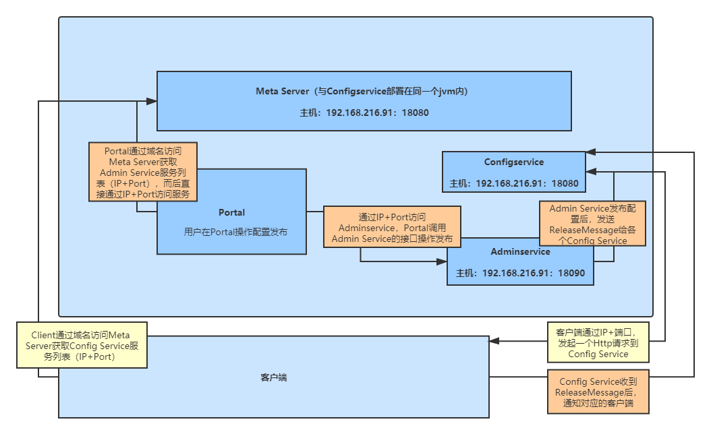
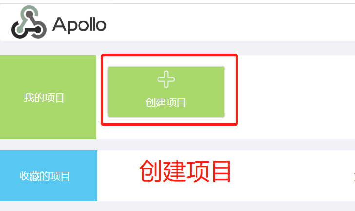
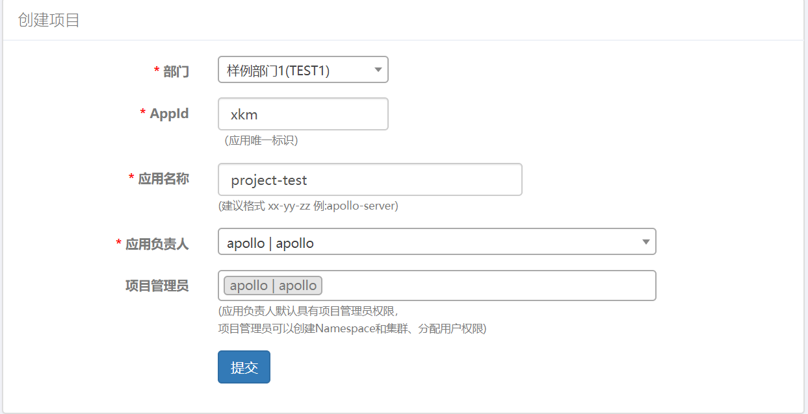
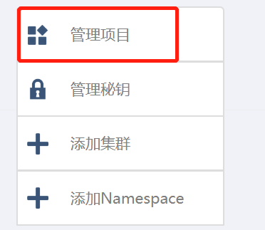

### 一、apollo多环境部署

------




#### 1、portal的部署

| 服务          | IP:端口            |
| ------------- | ------------------ |
| apollo-portal | 172.16.23.194:8070 |

#### 2、config service和admin service的部署

> Meta Server、Config Service和Admin Service在每个环境都单独部署，使用独立的数据库

| 环境 | 服务                 | IP:端口             |
| ---- | -------------------- | ------------------- |
| dev  | apollo-adminservice  | 172.16.23.194:18090 |
|      | apollo-configservice | 172.16.23.194:18080 |
| DEMO | apollo-adminservice  | 172.16.23.194:18091 |
|      | apollo-configservice | 172.16.23.194:18081 |
| API2 | apollo-adminservice  | 172.16.23.194:18092 |
|      | apollo-configservice | 172.16.23.194:18082 |
| PRO  | apollo-adminservice  | 172.16.23.194:18093 |
|      | apollo-configservice | 172.16.23.194:18083 |

#### 3、数据库部署

> 数据库部署在主机：192.168.216.89，监听端口：3306

| 服务名称                                       | 数据库名称          |
| ---------------------------------------------- | ------------------- |
| DEV：apollo-adminservice/apollo-configservice  | ApolloConfigDB_dev  |
| DEMO：apollo-adminservice/apollo-configservice | ApolloConfigDB_DEMO |
| API2：apollo-adminservice/apollo-configservice | ApolloConfigDB_API2 |
| PRO：apollo-adminservice/apollo-configservice  | ApolloConfigDB_PRO  |
| apollo-portal                                  | ApolloPortalDB      |

### 二、apollo多环境搭建

------

#### 1、环境准备：安装java-1.8

##### （1）用yum安装

```
yum search java  #查看java软件包的名字，找到1.8版本

yum -y install java-1.8.0-openjdk-devel
```

##### （2）查看是否下载成功

```
[root@docker log]# java -version
openjdk version "1.8.0_262"
OpenJDK Runtime Environment (build 1.8.0_262-b10)
OpenJDK 64-Bit Server VM (build 25.262-b10, mixed mode)
```

#### 2、创建数据库

##### （1）创建ApolloPortalDB

```
mysql -uroot -p'askdnC8Djsf!20' -h192.168.216.89 -P3306

#登陆数据库

source /usr/local/apollo/portal/ApolloPortalDB.sql;

#导入数据库

select `Id`, `Key`, `Value`, `Comment` from `ApolloPortalDB`.`ServerConfig` limit 1;   

#导入后测试是否成功
```

##### （2）创建ApolloConfigDB

> 每个环境下的ApolloConfigDB名称不一样，所以要修改ApolloConfigDB.sql里面的内容，DEV、DEMO、API2、PRO每个环境下都要进行建库操作，下面是以DEV环境修改为例，其他环境修改仿照DEV环境修改


```
mysql -uroot -p'askdnC8Djsf!20' -h192.168.216.89 -P3306

#登陆数据库

source /usr/local/apollo/dev/sql/ApolloConfigDB.sql;

#导入数据库

select `Id`, `Key`, `Value`, `Comment` from `ApolloConfigDB`.`ServerConfig` limit 1; 

#导入后测试是否成功
```

##### （3）调整服务端配置

- 调整ApolloPortalDB配置

```
use ApolloPortalDB;

#选中数据库进行操作

update ApolloPortalDB.ServerConfig set value=‘DEV,DEMO,API2,PRO’ where id=1;

#Portal管理多个环境

update ApolloPortalDB.ServerConfig set value='

{

"DEV":"http://192.168.216.91:18080",

"DEMO":"http://192.168.216.91:18081",

"API2":"http://192.168.216.91:18082",

"PRO":"http://192.168.216.91:18083",

}'  where id=8;

#Apollo Portal需要在不同的环境访问不同的meta service(apollo-configservice)地址，所以我们需要在配置中提供这些信息

select * from ServerConfig;

#查看ServerConfig表的内容有没有修改成功
```

- 调整ApolloConfigDB配置

> 以dev环境为例

```
use ApolloConfigDB_dev;

update ApolloConfigDB_dev.ServerConfig set value='http://192.168.216.91:18080/eureka/' where id=1;

#这里需要填写本环境中全部的eureka服务地址，因为eureka需要互相复制注册信息

select * from ServerConfig;
```

#### 3、apollo软件包准备

> 下载apollo的压缩包，把他们都整合到文件夹里面去


#### 4、apollo-adminserver配置文件的修改

> DEV、DEMO、API2、PRO每个环境下adminserver、configserver都要进行修改，下面是以DEV环境修改为例，其他环境修改仿照DEV环境修改

- ##### apollo-adminservice.conf文件

> 修改日志输出路径

```
cd /usr/local/apollo/dev/admin

vi apollo-adminservice.conf

#修改日志目录路径，修改内容如下：

MODE=service

PID_FOLDER=.

LOG_FOLDER=/opt/logs/dev/admin/
```

- ##### application-github.properties文件

> 修改数据库的连接信息

```
cd /usr/local/apollo/dev/admin/config

vi application-github.properties

#修改数据库的连接信息，修改内容如下：

spring.datasource.url = jdbc:mysql://192.168.216.89:3306/ApolloConfigDB_dev?useSSL=false&characterEncoding=utf8

#登陆数据库的URL，需要修改主机名和数据库名

spring.datasource.username = root

#登陆数据库的用户名

spring.datasource.password = askdnC8Djsf!20

#登陆数据库的密码
```

- ##### application-github.properties更名

> 修改完application-github.properties文件后，避免文件名出错，进行复制更名

```
cp application-github.properties application.properties
```

- ##### startup.sh文件

> 启动脚本

```
cd /usr/local/apollo/dev/admin/scripts

vi startup.sh

#分别找到定义日志目录、端口、jvm参数的变量，修改效果如下：

LOG_DIR=/opt/logs/dev/admin

SERVER_PORT=${SERVER_PORT:=18090}

export JAVA_OPTS="-Xms128m -Xmx128m -Xss256k -XX:MetaspaceSize=128m -XX:MaxMetaspaceSize=384m -XX:NewSize=128m -XX:MaxNewSize=128m -XX:SurvivorRatio=8
```

#### 5、apollo-configserver配置文件的修改

- ##### apollo-configservice.conf文件

> 修改日志输出目录路径

```
cd /usr/local/apollo/dev/config

vi apollo-configservice.conf

#修改存放日志的目录名

MODE=service

PID_FOLDER=.

LOG_FOLDER=/opt/logs/dev/config/
```

- ##### application-github.properties

> 修改数据库连接信息

```
cd /usr/local/apollo/dev/config/config

vi application-github.properties

#修改数据库的连接信息，修改内容如下：

spring.datasource.url = jdbc:mysql://192.168.216.89:3306/ApolloConfigDB_dev?useSSL=false&characterEncoding=utf8

spring.datasource.username = root

spring.datasource.password = askdnC8Djsf!20
```

- ##### application-github.properties更名

> 修改完application-github.properties文件后，避免文件名出错，进行复制更名

```
cp application-github.properties application.properties
```

- ##### startup.sh

> 启动脚本

```
cd /usr/local/apollo/dev/config/scripts

vi startup.sh

#分别找到定义日志目录、端口、jvm参数的变量，修改效果如下：

LOG_DIR=/opt/logs/dev/config

SERVER_PORT=${SERVER_PORT:=18080}

export JAVA_OPTS="-Xms128m -Xmx128m -Xss256k -XX:MetaspaceSize=128m -XX:MaxMetaspaceSize=384m -XX:NewSize=128m -XX:MaxNewSize=128m -XX:SurvivorRatio=8
```

#### 6、apollo-portal更改配置

- ##### apollo-portal.conf

> 修改日志输出目录路径

```
cd /usr/local/apollo/portal

vi apollo-portal.conf

#修改日志输出目录路径，修改内容如下：

MODE=service

PID_FOLDER=.

LOG_FOLDER=/opt/logs/portal/
```

- ##### application-github.properties

> 修改数据库连接信息

```
cd /usr/local/apollo/portal/config

vi application-github.properties

#修改portal连接数据库的信息

spring.datasource.url = jdbc:mysql://192.168.216.89:3306/ApolloPortalDB?useSSL=false&characterEncoding=utf8

#修改连接数据库的URL，需要修改数据库主机名

spring.datasource.username = root

#连接数据库的用户名

spring.datasource.password = askdnC8Djsf!20

#连接数据库的密码
```

- ##### application-github.properties

> 修改完application-github.properties文件后，避免文件名出错，进行复制更名

```
cp application-github.properties application.properties
```

- ##### apollo-env.properties

> 修改apollo-env.properties文件，Apollo Portal需要在不同的环境访问不同的meta service(apollo-configservice)地址，所以我们需要在配置中提供这些信息。默认情况下，meta service和config service是部署在同一个JVM进程，所以meta service的地址就是config service的地址。

```
cd /usr/local/apollo/portal/config

vi apollo-env.propertie

#apollo部署四类环境：DEV、DEMO、API2、PRO，在配置文件中需要记录他们各自的meta service(apollo-configservice)地址，修改效果如下：

dev.meta=http://192.168.216.91:18080

demo.meta=http://192.168.216.91:18081

api2.meta=http://192.168.216.91:18082

pro.meta=http://192.168.216.91:18083
```

- ##### startup.sh

> 启动脚本

```
cd /usr/local/apollo/portal/scripts

vi startup.sh

#分别找到定义日志目录、端口、jvm参数的变量，修改效果如下

LOG_DIR=/opt/logs/portal

export JAVA_OPTS="-Xms100m -Xmx100m -Xss256k -XX:MetaspaceSize=128m -XX:MaxMetaspaceSize=384m -XX:NewSize=100m -XX:MaxNewSize=100m -XX:SurvivorRatio=8"
```

8、关闭防火墙

```
systemctl stop firewalld
```

9、管理apollo

`./startup.sh`：启动服务

`./shutdown.sh`：停止服务

### 三、protal的web界面使用

------

#### 1、创建项目






#### 2、用户权限管理

（1）修改权：可以修改配置

（2）发布权：可以发布配置


3、项目管理管理员

项目管理员权限：

-  创建Namespace 
-  创建集群 
-  管理项目、Namespace


