### 一、Zabbix

------


#### 1、zabbix架构


`zabbix sever`：zabbix server是agent程序报告系统可用性、系统完整性和统计数据得核心组件，所有配置信息，统计信息和操作数据都经过zabbix server存储在数据库中

`zabbix database`：所有配置信息和zabbix收集到得数据都被存储在数据库中

`Web GUI`：为了从任何地方和任何平台都可以轻松地访问zabbix，zabbix提供基于Web的zabbix界面，该界面是zabbix server的一部分

`zabbix proxy`：可以替zabbix收集性能和可用数据，proxy代理服务器可以帮助单台zabbix server分担压力

`zabbix agent`：zabbix agent监控代理部署在监控目标上，能够主动监控本地资源和应用程序，并将收集到的数据报告给zabbix server

#### 2、zabbix运行流程

（1）Agent 从服务器中收集相关数据，传送给 Zabbix Server

（2）Server 把数据存储到数据库中

（3）Server 把数据分析之后以 Web 页面，展示出来

#### 3、zabbix监控对象

| 监控对象 | 对应的服务                           |
| -------- | ------------------------------------ |
| 数据库   | MySQL、MariaDB、Oracle、SQL Server、 |
| 应用软件 | Nginx、Apache、PHP、Tomcat           |
| 集群     | LVS、Kepppalived、HAproxy、RHCS、FS  |
| 虚拟化   | VMware、KVM、XEN、docker、k8s        |
| 操作系统 | Linux、Unix、Windows                 |
| 硬件     | 服务器、存储、网络设备               |
| 网络     | 网络环境（内网环境、外网环境）       |

#### 4、zabbix监控模式

> zabbix监控方式分为被动模式和主动模式

（1）`被动模式`：

- 概念：相对于agent而言，server向agent请求获取配置的各监控项相关的数据，agent接受请求，获取数据并响应给server
- 具体流程：
  - Server 打开一个TCP连接
  - Server 向agent询问数据
  - Agent 读取请求并响应 
  - Server 处理数据以获取值
  - TCP连接关闭

（2）`主动模式`：

- 概念：相对于agent而言，agent（active）向server请求与自己相关的监控项配置，主动地将server配置的监控项相关的数据发送给server
- 具体流程：
  - Agent 打开一个TCP连接
  - Agent 请求检查清单
  - Server 响应为监控项列表 (item key, delay)
  - Agent 解析响应
  - TCP 关闭连接
  - Agent 开始定期收集数据

#### 5、zabbix server如何获取数据

- 方式：zabbix agent向server发送收集到的值，如果在服务器上发送一些值失败(例如，因为主机或监控项被禁用或删除)，agnet将不会重试发送这些值

- 具体流程：
  - Agent 打开一个TCP连接
  - Agent 发送一个值列表
  - Server 处理数据并将状态返回
  - TCP 连接关闭

### 二、zabbix安装

------

#### 1、安装zabbix server

（1）安装zabbix repository

```
rpm -Uvh https://repo.zabbix.com/zabbix/5.0/rhel/7/x86_64/zabbix-release-5.0-1.el7.noarch.rpm

yum clean all
```

（2）安装zabbix server和agent（用来监控自身）

```
yum install zabbix-server-mysql zabbix-agent
```

（3）安装zabbix前端

- 安装scl源，避免与主要存储库中的文件冲突

```
yum install centos-release-scl
```

- 修改/etc/yum.repos.d/zabbix.repo，为下载软件包做准备

```
[zabbix-frontend]
...
enabled=1
...
```

- 安装软件包

```
yum install zabbix-web-mysql-scl zabbix-nginx-conf-scl
```

（4）创建数据库

```
# 登陆数据库

mysql -uroot -p

#创建zabbix的数据库

mysql> create database zabbix character set utf8 collate utf8_bin;

#创建数据库用户

mysql> create user zabbix@localhost identified by 'password';

#赋予zabbix用户操作数据库的权限

mysql> grant all privileges on zabbix.* to zabbix@localhost;

#退出数据库

mysql> quit;
```

（5）导入数据库

```
#create.sql中没有选中数据库的语句，所以要指定数据库进行操作

zcat /usr/share/doc/zabbix-server-mysql*/create.sql.gz | mysql -uzabbix -p zabbix
```

（6）修改zabbix server的配置文件

```
vi /etc/zabbix/zabbix_server.conf

#修改DB内容，效果如下：

DBHost=localhost
DBName=zabbix
DBUser=zabbix
DBPassword=gzjy5525
```

（7）修改PHP的配置文件

```
vi etc/opt/rh/rh-nginx116/nginx/conf.d/zabbix.conf

#找到server模块，修改内容如下：

listen 80;
server_name example.com;
```

```
vi /etc/opt/rh/rh-php72/php-fpm.d/zabbix.conf

#修改效果如下：

listen.acl_users = apache,nginx
php_value[date.timezone] = Asia/Shanghai
```

（8）修改zabbix agent的配置文件

```
vi /etc/zabbix/zabbix_agentd.conf

###修改效果如下###

#server主机加入具体的IP地址，方便在web界面手动添加主机时定义IP地址，127.0.0.1是本机IP的意思

Server=172.16.23.197,127.0.0.1

ServerActive=172.16.23.197,127.0.0.1

#zabbix agent的主机名，如果不定义，在网络自动发现时会调用主机名

Hostname=Zabbix server
```

（9）启动服务

```
systemctl restart zabbix-server zabbix-agent rh-nginx116-nginx rh-php72-php-fpm

systemctl enable zabbix-server zabbix-agent rh-nginx116-nginx rh-php72-php-fpm
```

（10）浏览器访问http://172.16.23.197

>  按照界面引导安装前端

#### 2、安装zabbix agent

（1）安装zabbix repository

```
rpm -Uvh https://repo.zabbix.com/zabbix/5.0/rhel/7/x86_64/zabbix-release-5.0-1.el7.noarch.rpm
yum clean all
```

（2）安装zabbix agent

```
yum install zabbix-agent
```

（3）修改配置

```
vi /etc/zabbix/zabbix_agentd.conf

####修改内容如下###

#zabbix server的IP

Server=172.16.23.197 

#主动模式下zabbix server的IP

ServerActive=172.16.23.197

#zabbix agent的主机名，如果不做定义，在网络发现中则会调用zabbix agent的主机名

Hostname=kubernetes02
```

（4）启动服务

```
systemctl start zabbix-agent

systemctl enable zabbix-agent
```

### 三、zabbix的常用文档

------


> rpm -ql zabbix-server-mysql可查看zabbix server软件包下载的文件

`/etc/zabbix/zabbix_server.conf`：zabbix server的配置文件

`/usr/lib/systemd/system/zabbix-server.service`：systemctl管理zabbix server的脚本

`/usr/share/doc/zabbix-server-mysql-5.0.2`：存放数据库文档的目录

`/usr/share/doc/zabbix-server-mysql-5.0.2/create.sql.gz`：存放zabbix数据库表结构和数据的sql文件
`/var/log/zabbix`：日志目录，存放zabbix_server.log日志文件


> rpm -ql zabbix-agent可查看zabbix agent软件包下载的文件

`/etc/zabbix/zabbix_agentd.conf`：zabbix agent的配置文件

`/usr/lib/systemd/system/zabbix-agent.service`：systemctl管理zabbix agent的脚本

`/var/log/zabbix`：日志目录，存放zabbix_agentd.log日志文件


> rpm -ql zabbix-nginx-conf-scl可查看nginx关于zabbix的配置文件

`/etc/opt/rh/rh-nginx116/nginx/conf.d/zabbix.conf`：web页面配置


> 其他文档

`/etc/opt/rh/rh-php72/php-fpm.d/zabbix.conf`：php的配置文件

### 四、zabbix的使用

------

#### 1、主机组：

主机的逻辑组，它包含主机和模板，一个主机组内的主机和模板之间并没有任何直接的关系，通常给不同用户组的主机分配权限时使用主机组

#### 2、主机：

是一个你想要监控的网络实体（物理的，或者虚拟的），它可以是一台物理服务器，一个网络交换机，一个虚拟机或者一些应用

> 配置（Configuration） →主机（hosts ）→创建主机（create host）

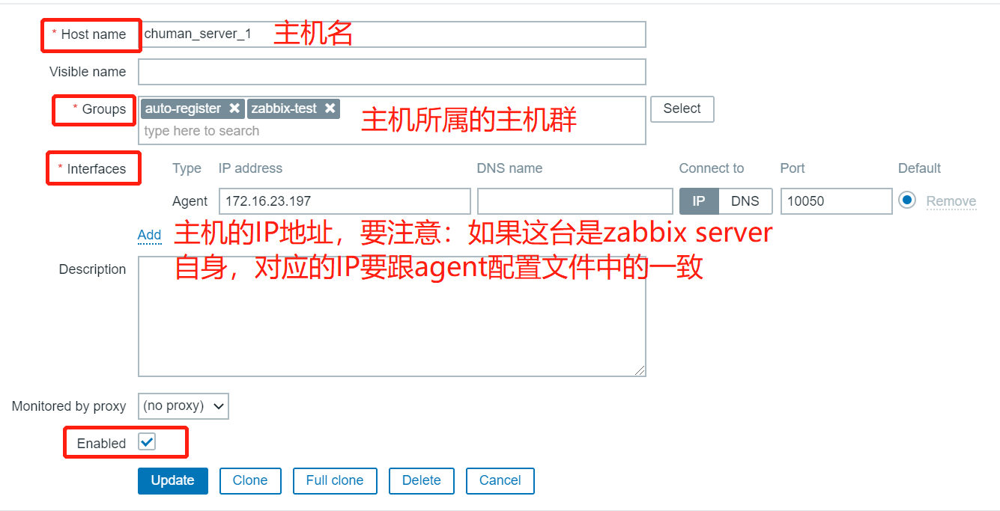

#### 3、监控项：

被监控主机的特定数据，一个流量数据

> 主机（hosts） →在主机页面查找到新建的主机 →在新主机行中找到监控项（items） →进入创建item界面 →创建监控项（create item）


查看数据:

> 前往监控（Monitoring）→ 最新数据（Latest data），然后点击监控项后的'图表（Graph）

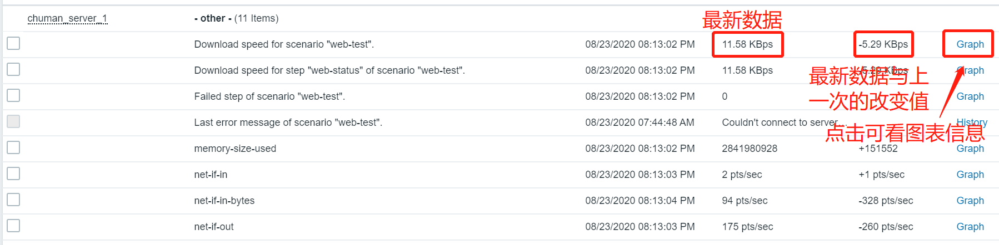

#### 4、触发器：

##### （1）概念：

- 监控项只是用于收集数据，如果需要自动评估收到的数据，我们则需要定义触发器。触发器包含了一个表达式，这个表达式定义了数据的可接受的阈值级别，其结果如下：
  - OK：正常状态
  - PROBLEM：非正常状态

##### （2）判定采样数据是否为合理区间的比较稳妥的方法：

- 根据最后N次的平均值来判定结果，这个最后N次通常有两种定义方式：
  - 最近N分钟所得结果的平均值
  - 最近N次所得结果的平均值

##### （3）触发器之间的依赖关系：

- 触发器彼此之间可能会存在依赖关系，一旦某个触发器被触发了，那么依赖这个触发器的其余都不需要再报警，设置依赖关系可以抑制不必要的通知，而只发送根本问题的通知

##### （4）触发器表达式格式：

```
{<server>:<key>.<function>(<parameter>)}<operator><contant>
```

- **server**：主机名
- **key**：主机上关系的相应监控项的key

- **function**：评估采集到的数据是否在合理范围内所使用的函数，其评估过程可以根据采取的数据、当前的时间以及其他因素进行，常用函数有：

  | 函数                       | 作用                                                         |
  | -------------------------- | ------------------------------------------------------------ |
  | abschange                  | 最近获取值与之前获取值差的绝对值                             |
  | avg (sec#num,<time_shift>) | 平均值，sec or #num - 评估期以秒值或最新值个数，time_shift （可选） - 时间偏移 |
  | change                     | 最近获取值与之前获取的差                                     |
  | date                       | 当前日期，返回格式：YYYYMMDD                                 |
  | time                       | 当前时间，返回格式：HHMMSS                                   |
  | dayofweek                  | 当前是本周的第几天，周一（1）到周日（7）                     |
  | delta                      | 最大值和最小值的差                                           |
  | max                        | 最大值                                                       |
  | min                        | 最小值                                                       |
  | nodata                     | 检查是否没有收到数据，返回数字1-收到数据，0则为没有          |

- **parameter**：函数参数，大多数数值函数可以接受秒数作为参数，而如果在数值参数之前使用“#”作为前缀，则表示为最近几次的取值，比如sum（#10）表示：最近十次取值之和

- **operator**：操作

  | OPERATOR | DEFINITION                           |
  | -------- | ------------------------------------ |
  | +        | 加法                                 |
  | -        | 减法                                 |
  | *        | 乘法                                 |
  | /        | 除法                                 |
  | >        | 大于，a>b：a>=b+0.000001             |
  | <        | 小于，a<b-0.000001                   |
  | #        | 不等于，a<=b-0.000001\|a>=b+0.000001 |
  | =        | 等于，a>b-0.000001&a<b+0.000001      |
  | &        | 与                                   |
  | \|       | 或                                   |

##### （5）创建触发器

> 配置（Configuration） → 主机（Hosts），找到新增主机（New host），点击旁边的触发器（Triggers）  →创建触发器（Create trigger）

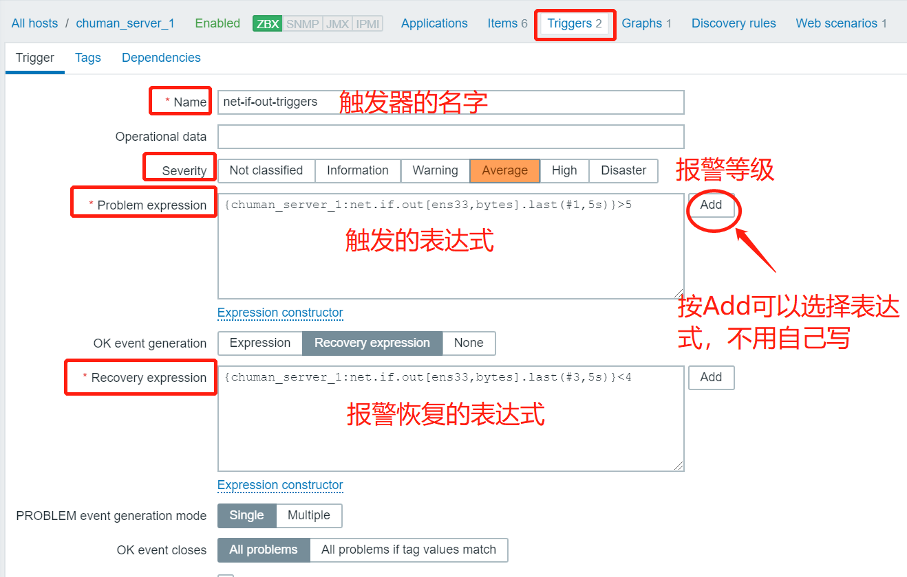

查看监控：

> 监控（Monitoring） → 问题（Problems）

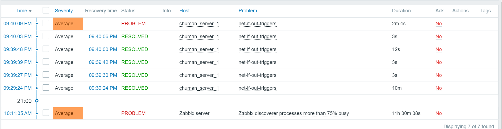

#### 5、动作：

Zabbix的功能就是用用来进行监控的，当监控的对象出现问题时我们就需要告知维修人员及时过来维修，那么从监控，到出现监控异常，将监控异常报告给维修人员这一系列动作需要zabbix的Action来关联完成

#### 6、网络发现:

使用网络发现可以解决手动批量注册zabbix-agent的问题，可以加快zabbix部署，使管理简单化，Zabbix网络发现基于以下信息：

- IP范围
- 可用的外部服务（FTP、SSH、WEB、POP3、IMAP、TCP等）
- 来自Zabbix客户端的信息（仅支持未加密模式）
- 来自snmp客户端的信息

#### 7、媒介：

发送告警通知的手段，告警通知的途径

#### 8、zabbix可视化:

可以自定义图形观察数据，自定义图形有以下几类：

- normal：线状图
- stacked：堆叠图
- pie：饼图
- exploded：分离性饼图

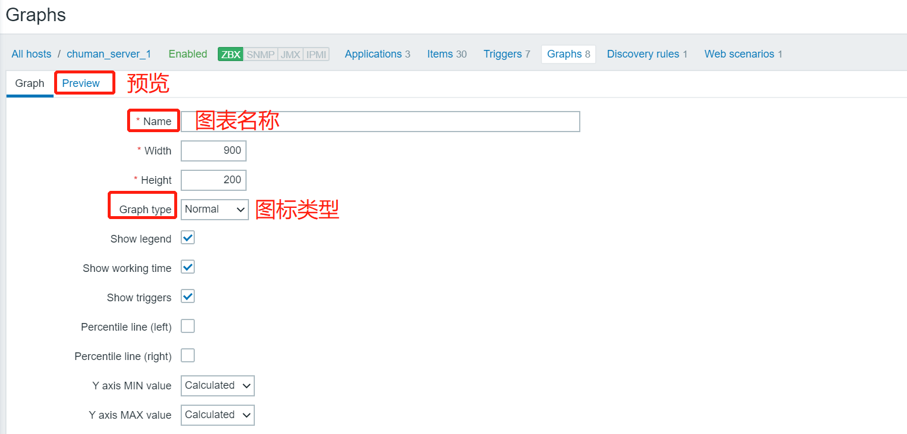

#### 9、模板：

（1）概念：

- 一组可以被应用到一个或多个主机上的实体（监控项、触发器、图形、聚合图形、应用、LLD、Web场景）的集合

（2）好处：

- 模板的任务是加快对主机监控任务的实施，也可以使监控任务的批量修改更简单

（3）创建模板

> 配置（Configuration） → 模版（Templates） →点击创建模版（Create template）

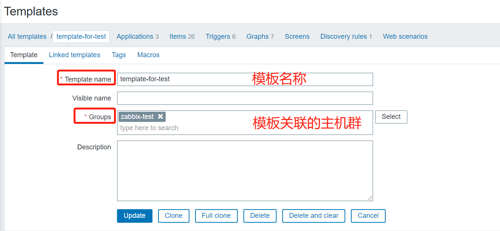

> 关联模板，是一个继承关系，当一个模版链接到一个主机后，主机会继承这个模版中的所有对象

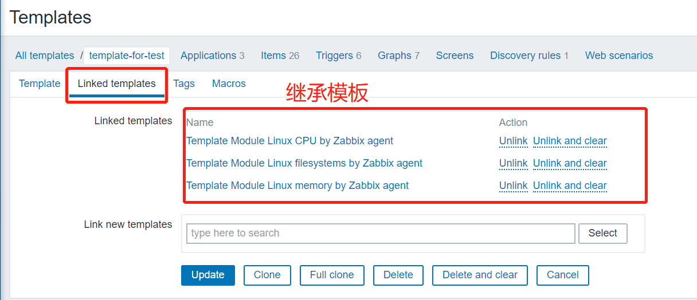

> 自定义监控项，不限于原有模板的功能

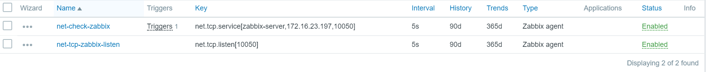

> 自定义触发器

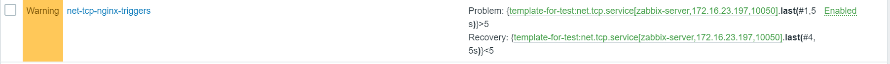

> 关联主机：配置（Configuration） → 主机（Hosts），点击'新主机（New host）'打开表单，前往模版（Templates）标签页

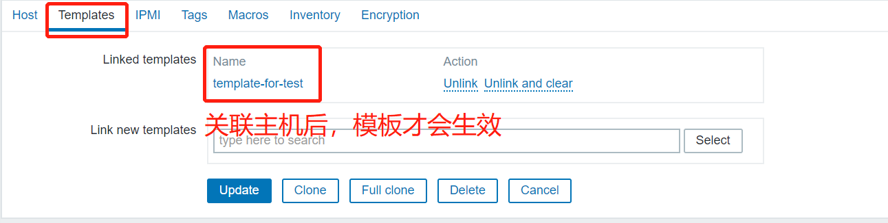

> 查看模板：配置（Configuration）→模板（Templates）

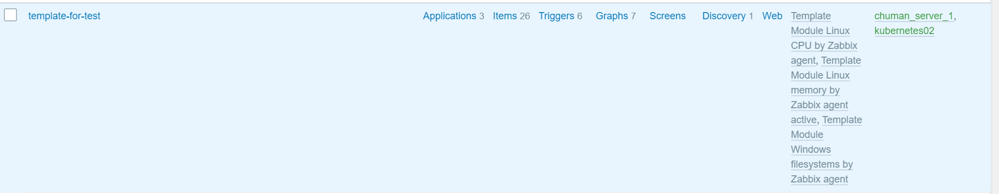

#### 10、web监控：

##### （1）概念：

- web监控是用来监控指定站点的资源下载速度、以及页面响应时间还有响应代码

##### （2）相关术语：

- `web Scenario`：web场景（站点）
- `web step`：步骤，对于web场景进行的监控，
- `内建key`：要测三个内建key
  - 传输速率
  - 响应时长
  - HTTP响应码

##### （3）web step参数：

- `NAME`：唯一步骤名称

- `URL`：用于连接和检索数据的网址

- `Query fields`：URL的HTTP GET变量

- `Post`：URL的HTTP POST变量
  - Form data 模式下，指定属性和值，值被自动进行 URL 编码
  - Raw data 模式中，属性 / 值显示在一条线上，并与 & 符号连接。手动进行 URL 编码 / 解码。

- `Variables`：可用于 GET 和 POST 方法的步级变量，步骤变量改变，会覆盖之前的场景变量或步骤变量，一个步骤变量的值仅影响之后的步骤（而不是当前步骤）

- `Headers`：执行请求时将发送的自定义 HTTP headers

- `Follow redirects`：跟踪 HTTP 重定向

- `Retrieve only headers`：仅从 HTTP 响应中检索标题

- `Timeout`：Zabbix 根据设置的秒数以内来处理 URL

- `Required string`：除非检索到的内容（HTML）匹配所需的模式，否则步骤将失败。 如果为空，则不执行检查

- `Required status codes`：设置预期的 HTTP 状态代码列表

##### （4）创建设置web场景：

- 创建web场景

>  配置 (Configuration) –> 主机（hosts）–>找到主机一行的Web –>点击右上角 创建 web 场景

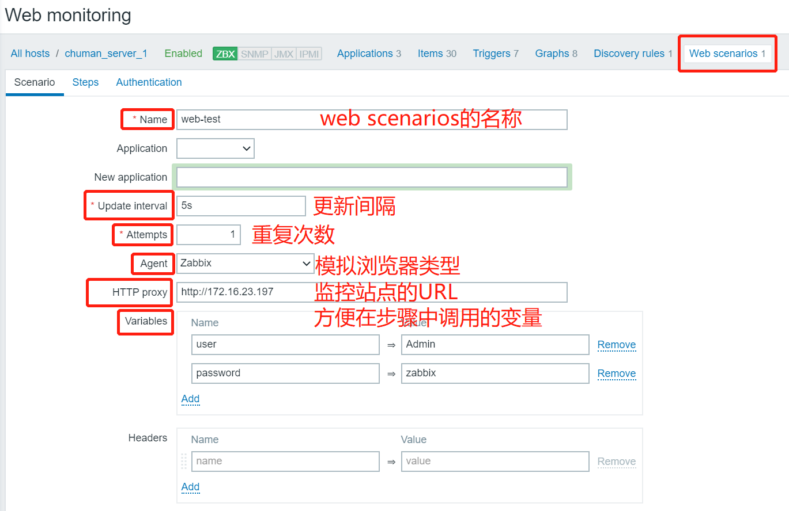

- 创建web step

  - 首页检测

    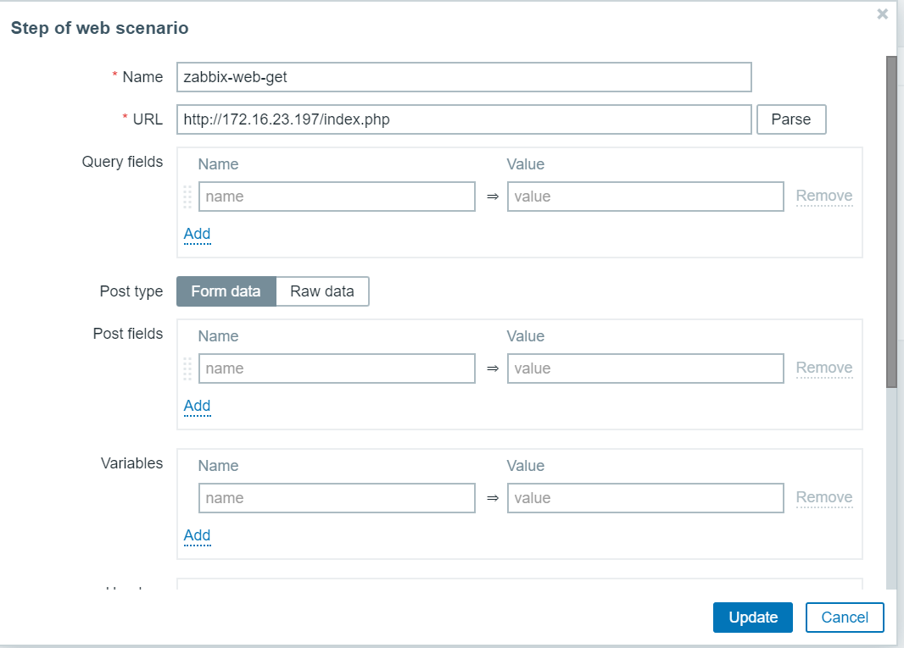

    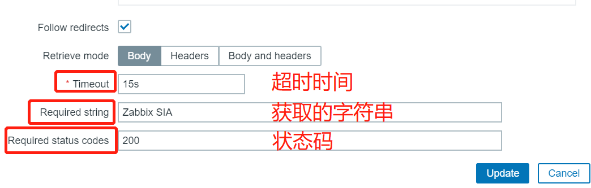

  - 登陆

    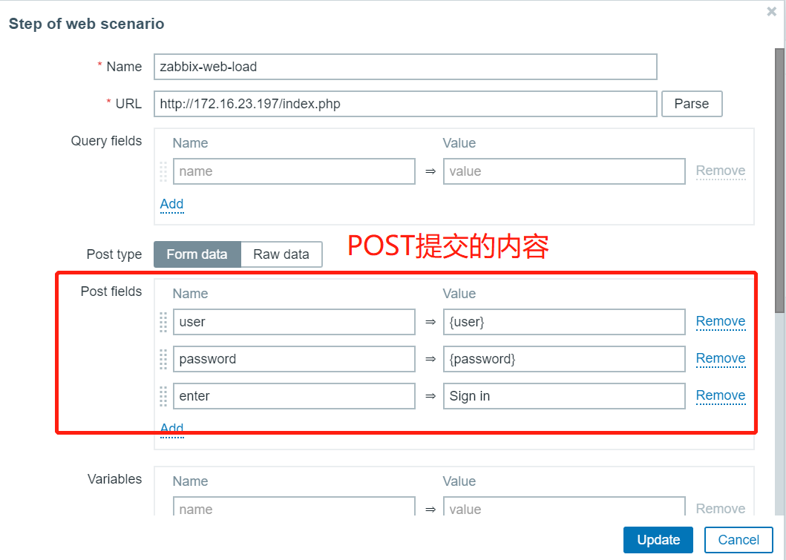

    

  - 登陆检测

    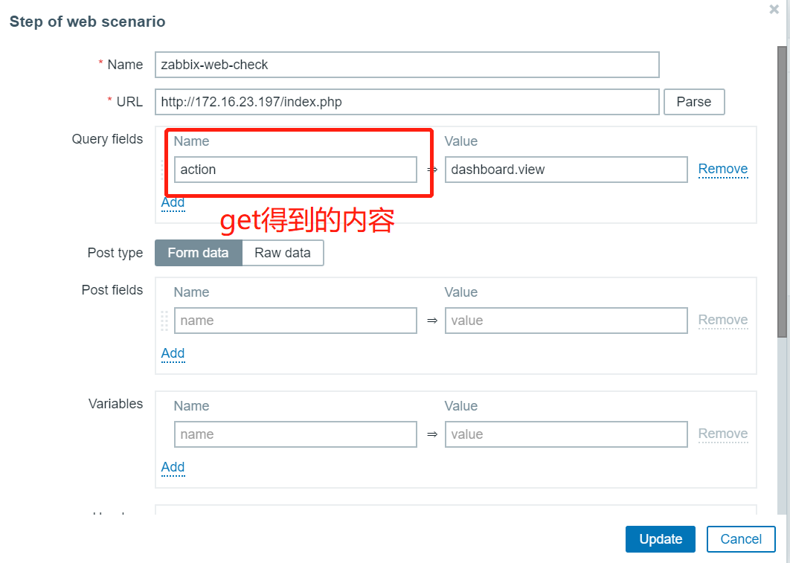

    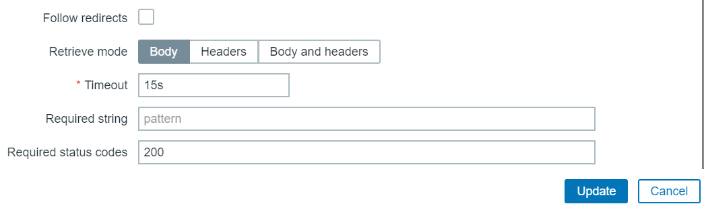

    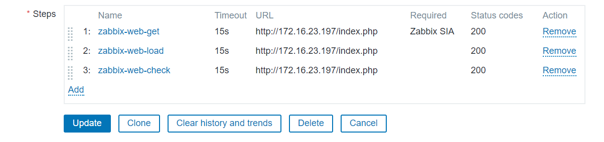

- 查看web检测结果

> 监控中 (Monitoring)→host→在主机行中找到web选项点击→点击刚创建的web新监控，可看到结果

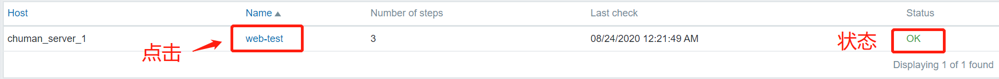

### 五、实现zabbix agent自动注册

------


#### 1、创建新的主机群

#### 2、创建网络发现规则（基于IP）

> 配置（configuration）*→* 发现（discovery）*→* 创建发现规则（create discovery rule）


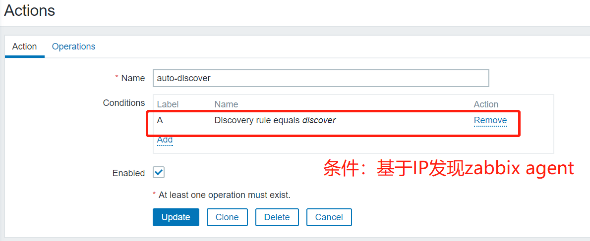

#### 3、创建动作

> 配置（configuration）*→*动作（action），选择Discovery acions*→*创建动作（create cation）

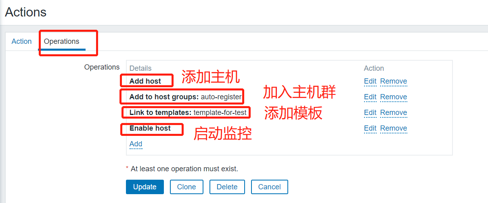

#### 3、启动zabbix agent

```
systemctl start zabbix-agent
```

#### 4、查看发现

> 监测（Monitoring）*→* 发现（Discovery）可以看到发现规则是否生效

#### 5、查看自动注册是否正常

> 配置（Configuration）*→*主机群（host group）

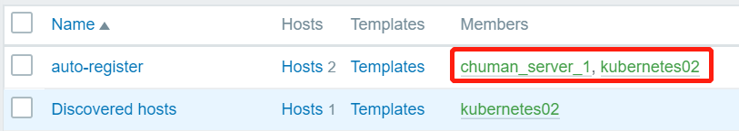
